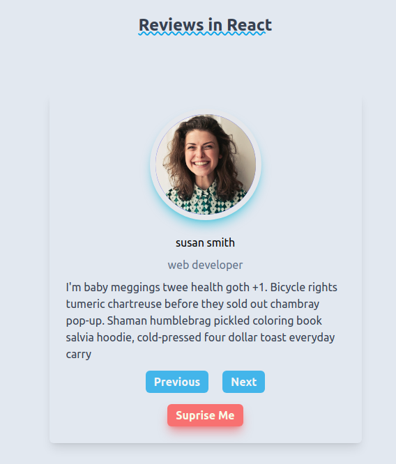
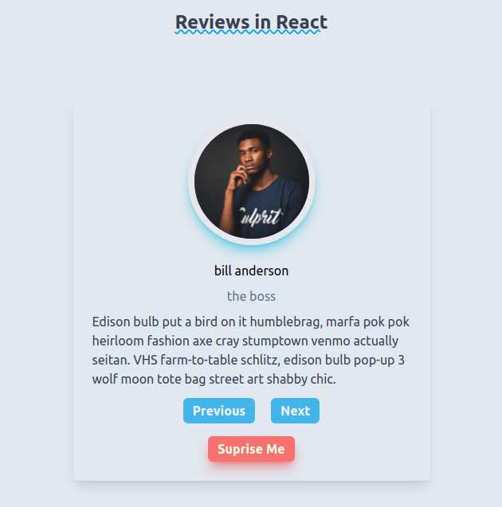

# Review Carousel React





The default template project for [nano-react-app](https://github.com/nano-react-app/nano-react-app).

- `npm start` — This will spawn a development server with a default port of `3000`.
- `npm run build` — This will output a production build in the `dist` directory.

## Custom port

You can use the `-p` flag to specify a port for development. To do this, you can either run `npm start` with an additional flag:

```
npm start -- --port 1234
```

Or edit the `start` script directly:

```
vite --port 1234
```
# How it works
- data.js is used to mock API request
- Cards are selected using the data array and a number based array
- Card gets selected based on the data[num] of array
- Tailwind CSS used for Styles

# Features
- Next Button for going to next review
- Previous Button for going in the previous stored review
- Suprice button for selcting a random review
- Tailwind CSS 3.0 used for cool effects

